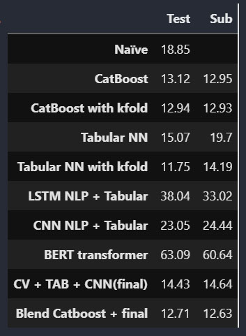

## Car price prediction: part two

The goal of this work was to predict the car price using provided data.   
The data contains csv file with characteristics and image files.  
As we have different types of data, I have used several methods to deal with them:
* classic ML method(Catboost), tabular NN for tabular data;
* NLP NN (LSTM,Convolutional NN, BERT) for text of descriptions;
* Computer vision NN (EfficientnetB6) for images;
* Multi-input NN;
* Ensembling models and blending their predictions.

At first I have investigated and cleaned data, made data preprocessing and EDA.  
Then I've trained several models and predicted prices with them.  
During the work I have gathered metrics for models, that are presented in a table below:  

As we can see the best result on submission was shown by Catboost + final(Multi-input NN ) by Blending.  
As for NLP models, the best result has a Convolutional network. 
 
