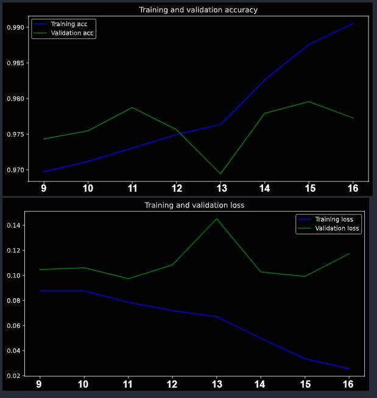

# Car models classification
 
 ## Introduction
 The goal was to predict car model by it's image. In the beginning we've got 15561 of train images and 6675 images to predict their model. Also there was an csv file with image names and classes for train data.
## 1.Getting images

I have rewritten the code of parsers from previous project to get more images. Then I've merged them with given data and, finally, there were    30601 images to train on.
## 2. Eploratory Data Analysys

During the EDA we can look on the images and the class distribution, that was not normal. However it is not the problem. Also the median value of image size were calculated here, to use it on step 4.

## 3. Fitting model

### 3.1 Transfer learning
I've downloaded the EfficientNetB6
to use it as a base model and made it's layers untrainable. There is a structure of the resulting model:

 

efficientnet-b6 (Functional) (None, 7, 7, 2304)        40960136  
_________________________________________________________________
global_average_pooling2d_3 ( (None, 2304)              0         
_________________________________________________________________
batch_normalization_3 (Batch (None, 2304)              9216      
_________________________________________________________________
dense_3 (Dense)              (None, 10)                23050     

#### Total params: 40,992,402
#### Trainable params: 27,658
#### Non-trainable params: 40,964,744
### 3.2 Fine-tuning
At first step I've trained the model with freezed base model, then I've unfreezed half of layers, and on step 3 all layers were trainable. The result on leaderboard were 0.9537.

Then I've added the albumentations and got 0.96779.

After downloading new images the accuracy has rised only to 0.96794.Maybe it because of small image size.

On step 4, after increasing the image size I've got 0.97573 on 13'th epoch.

## 4. Test time augmentation

During the TTA I've used three methods: augmentation with datagenerator, albumentations and keras layers. But I've could not get the adequate predictions. It seems like I've missed something, so in the future I will investigate this theme. 
## 5. Ensembling
The best results were on the step 4 epochs 12,13,14. As we can see on graphics the model overfitted after 12-th epoch:

#### Accuracy on several epochs of step 4:
* S4ep12 : 0.97558
* S4ep13 : 0.97573
* S4ep14 : 0.97123
#### But, nevertheless, the best result on leaderboard was shown by 13-th epoch - 0.97797 . On my opinion, in real life (or with private leaderboard) it is better to use 12-th epoch.

## Conclusion
During this work I've used these methods to improve the accuracy:
* Enriching the train data twice by parser
* Advanced augmentations with albumentations library
* Callbacks during the education
* EfficientNetB6 with transfer learning and fine-tuning
* Test time augmentation (failed)
* Ensemling the models

At first look, there were no result of enriching the data, but it may took an effect after the image size increasing. Now I have no time to check this hypothesis, but in comparing with other competitors I've got a good result and I think new data has an influence.

I have made a simple python file to show the model in work. As I said above, in real life I prefer to use the 12-th epoch model, because it has not overfitted.